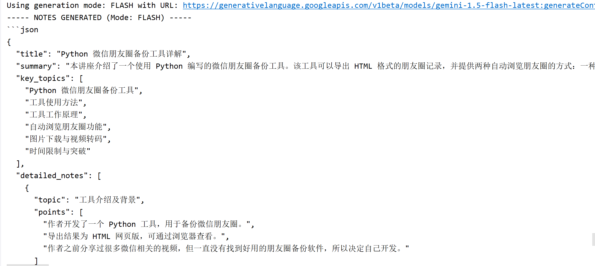

# AI 视频笔记生成器 (AI Video Notes Generator)

[](https://www.java.com)
[](https://spring.io/projects/spring-boot)
[](https://opensource.org/licenses/MIT)

这是一个基于 Java 21 和 Spring Boot 3 构建的高性能后端服务，能够根据在线视频内容（当前支持 YouTube），通过多模态 AI 模型自动生成结构化的学习笔记。

**[查看项目第一阶段 OneNote 报告](https://github.com/fan2515/ai-video-notes/blob/main/docs/Phase1_Report.md)** | **[查看项目第二阶段 OneNote 报告](https://github.com/fan2515/ai-video-notes/blob/main/docs/Phase2_Report.md)**

---

### 🚀 演示 (Demo)

*插件成功触发后端，处理在线视频并生成笔记的控制台日志：*



*插件界面：*


---

### 🏛️ 系统架构 (System Architecture)


---

### ✨ 项目亮点 (Features)

*   **现代化技术栈**: 采用 **Java 21 + Spring Boot 3**，并开启**虚拟线程 (Virtual Threads)** 以极低的资源消耗支持高并发 I/O 操作。
*   **端到端自动化**: 实现了从 `API 请求` -> `在线视频下载` -> `音频提取` -> `多模态 AI 分析` -> `数据持久化` -> `结果查询` 的全自动化处理流程。
*   **前沿多模态 AI 集成**: 成功对接 **Google Gemini 1.5**，实现了直接处理**音频文件**生成笔记的**多模态**能力，架构更简洁、高效。
*   **动态模型选择**: 后端支持根据 API 请求参数，在 **`Flash` (高速) 模型**和 **`Pro` (高质量) 模型**之间动态切换，兼顾了响应速度与分析质量。
*   **健壮的外部系统集成**: 稳定集成 **`yt-dlp`** 和 **`ffmpeg`**，并通过**外部化 Cookies** 的方式解决了 YouTube 复杂的反爬虫验证问题。
*   **专业的工程实践**:
    *   **配置安全**: 所有敏感信息（API Key）均通过**环境变量**管理。
    *   **Prompt 工程**: 将 Prompt **从业务代码中分离**至外部模板文件，便于快速迭代。
    *   **异步处理**: 核心业务流程采用 `@Async` 实现**完全异步化**。
    *   **API 设计**: 提供了 RESTful 风格的 API，并通过 **DTO** 模式实现了前后端的数据解耦。
    *   **全栈交互**: 配备了一个**浏览器插件**原型，用于触发后端服务，展示了全栈应用的设计思路。

---

### 🛠️ 技术栈 (Tech Stack)

*   **后端**: Spring Boot, Spring Data JPA
*   **语言**: Java 21
*   **AI 模型**: Google Gemini 1.5 Pro / Flash (多模态)
*   **媒体处理**: yt-dlp, FFmpeg
*   **数据库**: H2 (开发阶段)
*   **构建工具**: Maven
*   **前端原型**: Chrome/Edge Extension (HTML, CSS, JavaScript)
*   **其他**: Lombok, Jackson, Jasypt

---

### 🚀 快速开始 (Quick Start)

1.  **环境准备**
    *   安装 JDK 21
    *   安装 Maven
    *   安装 `yt-dlp` 和 `ffmpeg`，并确保它们在系统环境变量 `Path` 中。
    *   安装 Chrome 或 Edge 浏览器，并安装 `Get cookies.txt LOCALLY` 插件。

2.  **克隆仓库**
    ```bash
    git clone https://github.com/fan2515/ai-video-notes.git
    cd ai-video-notes
    ```

3.  **准备 Cookies 文件**
    *   登录 YouTube，使用 `Get cookies.txt LOCALLY` 插件导出一个 **Netscape 格式** 的 Cookies 文件。
    *   将该文件的内容复制到项目根目录下的 `manual-cookies.txt` 文件中。

4.  **配置环境变量**
    *   在 IntelliJ IDEA 的运行配置中，设置 `GEMINI_API_KEY`。

5.  **运行后端服务**
    *   直接运行 `AiVideoNotesApplication.java` 主类。

6.  **加载浏览器插件**
    *   打开浏览器扩展程序页面 (`chrome://extensions`)，启用开发者模式。
    *   点击“加载已解压的扩展程序”，选择项目中的 `chrome-extension` 文件夹。

7.  **开始使用！**
    *   打开任意 YouTube 视频页面，点击插件图标，点击“生成笔记”。
    *   任务完成后，通过以下 API 查询结果（其中 `{noteId}` 为后端日志中打印的 ID）：
      ```bash
      GET http://localhost:8080/api/notes/{noteId}
      ```

---
### 许可证 (License)

本项目采用 [MIT License](LICENSE)。
