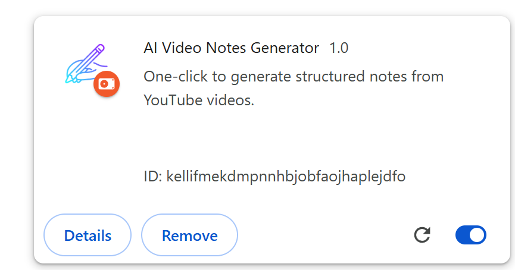
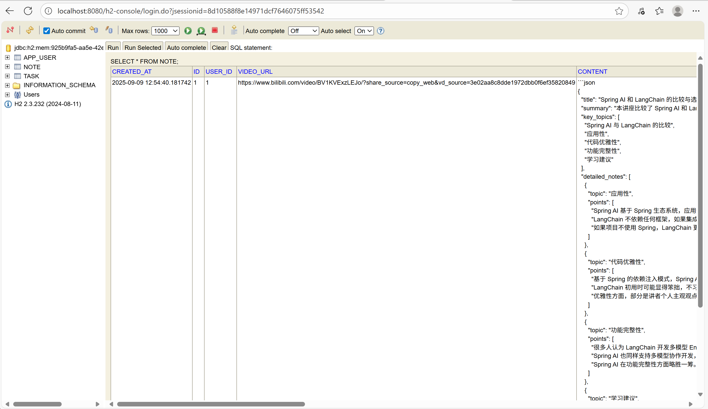
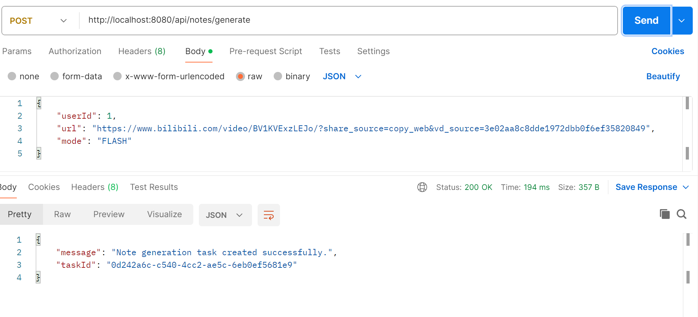
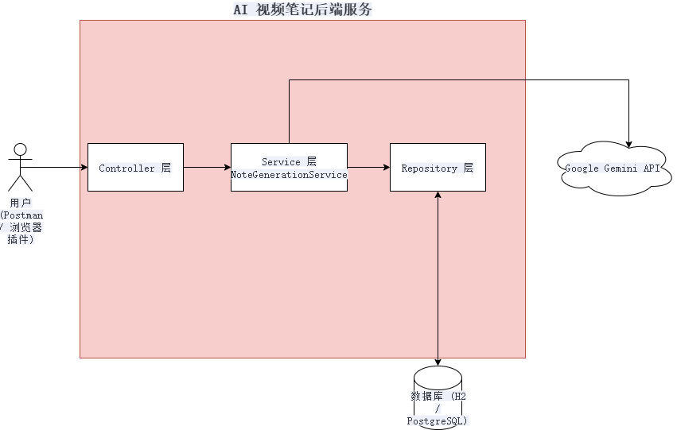

# AI 视频笔记生成器 (AI Video Notes Generator)

[](https://www.java.com)
[](https://spring.io/projects/spring-boot)
[](https://github.com/fan2515/ai-video-notes/blob/main/LICENSE)
[](https://github.com/fan2515/ai-video-notes/releases)

**一个从零到一，攻克无数真实世界工程难题，最终实现的全功能、全栈 AI 视频笔记应用原型。**

这个项目由一个强大的 **Java 后端服务**和一个轻量级的**浏览器插件**组成，能够将在线视频（当前稳定支持 Bilibili）一键转化为结构化的学习笔记。

---

### 🚀 演示 (Demo)

**1. 在 Bilibili 视频页面，点击插件图标，一键“生成笔记”。**


**2. 插件实时轮询后端，展示任务处理状态，最终完美渲染出 AI 生成的笔记！**


**3. 后端控制台展示了从下载到 AI 分析的完整自动化处理流程。**


---

### 🏛️ 系统架构 (System Architecture)



---

### ✨ 项目亮点与技术深度 (Features & Technical Depth)

这个项目不仅仅是一个功能应用，更是一次深入真实世界后端开发的完整实践。

*   **现代化技术栈**: 采用 **Java 21 + Spring Boot 3**，并开启**虚拟线程 (Virtual Threads)** 以极低的资源消耗支持高并发 I/O 操作。

*   **全栈与端到端闭环**: 实现了从**浏览器插件**（前端）的用户交互，到后端**异步任务处理**，再到**数据持久化**和**API 查询**的完整产品功能闭环。

*   **前沿多模态 AI 集成**: 摒弃了传统的“STT+LLM”两步法，直接利用 **Google Gemini 1.5** 的**多模态能力**，通过 **Base64 编码**将音频文件内联在请求中，一步到位地完成了从音频到结构化文本的转换。

*   **健壮的外部系统集成**:
    *   稳定集成 **`yt-dlp`** 和 **`ffmpeg`**，实现了对在线视频的下载和处理。
    *   在开发过程中，系统性地诊断并最终解决了因 YouTube **反爬虫策略**导致的下载失败问题，并最终通过切换数据源到 **Bilibili** 保证了流程的稳定性。

*   **专业的工程与架构实践**:
    *   **异步任务管理**: 实现了包含 `PENDING`, `PROCESSING`, `COMPLETED`, `FAILED` 状态的**异步任务管理系统**，并通过 API 提供了任务状态的**轮询查询**能力。
    *   **JPA 深度应用**: 解决了因**懒加载 (`LAZY`)**、**异步 (`@Async`)** 和**事务 (`@Transactional`)** 共同作用下导致的**数据一致性**难题，最终通过调整为**即时加载 (`EAGER`)** 保证了数据完整性。
    *   **动态模型选择**: 后端支持根据 API 请求参数，在 **`Flash` (高速) 模型**和 **`Pro` (高质量) 模型**之间动态切换。
    *   **单元测试**: 编写了基于 **JUnit 5 + Mockito** 的**单元测试**，对核心业务逻辑进行了覆盖，确保了代码的可靠性。
    *   **配置安全与解耦**: 所有敏感信息均通过**环境变量**管理；**Prompt** 从业务代码中分离至外部模板文件。

---

### 🛠️ 技术栈 (Tech Stack)

*   **后端**: Spring Boot, Spring Data JPA
*   **语言**: Java 21
*   **AI 模型**: Google Gemini 1.5 Pro / Flash (多模态)
*   **媒体处理**: yt-dlp, FFmpeg
*   **数据库**: H2 (开发阶段)
*   **测试**: JUnit 5, Mockito
*   **前端原型**: Chrome/Edge Extension (HTML, CSS, JavaScript)
*   **其他**: Lombok, Jackson, Jasypt

---

### 🚀 快速开始 (Quick Start)

1.  **环境准备**
    *   安装 JDK 21, Maven, `yt-dlp`, `ffmpeg` 并配置好系统环境变量 `Path`。

2.  **克隆仓库**
    ```bash
    git clone https://github.com/fan2515/ai-video-notes.git
    cd ai-video-notes
    ```

3.  **配置环境变量**
    *   在 IntelliJ IDEA 的运行配置中，设置 `GEMINI_API_KEY`。

4.  **运行后端服务**
    *   在 `AiVideoNotesApplication.java` 中配置好你的网络代理（如果需要）。
    *   直接运行 `AiVideoNotesApplication.java` 主类。

5.  **加载浏览器插件**
    *   打开浏览器扩展程序页面 (`chrome://extensions`)，启用开发者模式。
    *   点击“加载已解压的扩展程序”，选择项目中的 `chrome-extension` 文件夹。

6.  **开始使用！**
    *   打开任意 Bilibili 视频页面，点击插件图标，点击“生成笔记”。
    *   任务完成后，笔记将直接显示在插件窗口中。

---
### 📝 未来计划 (Future Roadmap)

*   **插件功能增强**:
    *   美化插件 UI 界面。
    *   支持笔记内容的 Markdown 格式渲染。
    *   增加历史笔记查看功能。
*   **后端服务强化**:
    *   引入任务队列，实现对高并发请求的削峰填谷。
    *   支持更多视频网站（如 YouTube）。

---
### 📄 许可证 (License)

本项目采用 [MIT License](LICENSE)。